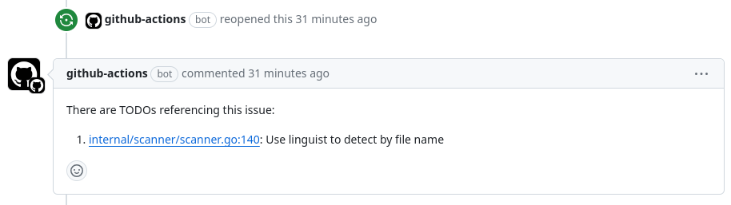

# `todo-issue-reopener`

[](https://github.com/ianlewis/todo-issue-reopener/actions/workflows/pull_request.tests.yml)
[](https://codecov.io/gh/ianlewis/todo-issue-reopener)
[](https://securityscorecards.dev/viewer/?uri=github.com%2Fianlewis%2Ftodo-issue-reopener)
[](https://slsa.dev)

The `ianlewis/todo-issue-reopener` GitHub Action uses the
[`todos`](https://github.com/ianlewis/todos) tool to search your checked out
code for TODO comments that reference issues and reopens issues that have been
closed prematurely. `todo-issue-reopener` will also add a comment on the issue
with a link to the source code where the TODO can be found.



TODO comments can take the following forms:

```golang
// TODO(#123): Referencing the issue number with a pound sign.
// TODO(123): Referencing the issue number only.
// TODO(github.com/owner/repo/issues/123): Referencing the issue url without scheme.
// TODO(https://github.com/owner/repo/issues/123): Referencing the issue url with scheme.
```

See the [`todos`
documentation](https://github.com/ianlewis/todos/blob/main/README.md#todo-comment-format)
for more info on supported formats for TODO comments.

## Getting Started

First use the `actions/checkout` action to check out your repository. After
that you can call `ianlewis/todo-issue-reopener` to scan your codebase for TODO
comments.

Note that you must set the `issues: write` permission on the job if using the
default `GITHUB_TOKEN`. Also note that the directory scanned must be in a git
checkout.

```yaml
on:
    workflow_dispatch:
    schedule:
        - cron: "0 0 * * *"

permissions: {}

jobs:
    issue-reopener:
        runs-on: ubuntu-latest
        permissions:
            # NOTE: contents: read is necessary for private repositories.
            contents: read
            issues: write
        steps:
            - uses: actions/checkout@v3
            - name: Issue Reopener
              uses: ianlewis/todo-issue-reopener@v1.7.0
```

## Inputs

| Name          | Required | Default                      | Description                                                                |
| ------------- | -------- | ---------------------------- | -------------------------------------------------------------------------- |
| `path`        | No       | `github.workspace`           | The root path of the source code to search.                                |
| `token`       | No       | `github.token`               | The GitHub token to use. This token must have `issues: write` permissions. |
| `dry-run`     | No       | `false`                      | If true, issues are only output to logs and not actually reopened.         |
| `config-path` | No       | `.github/issue-reopener.yml` | Path to an optional [configuration file](#configuration).                  |

## Outputs

There are currently no outputs.

## Configuration

An optional configuration file in YAML format can added to your repository. The
path can be specified by the `config-path` input. It defaults to
`.github/issue-reopener.yml`.

### `vanityURLs`

Some projects use a custom vanity URL for issues. `vanityURLs` is a list of
[`RegExp`](https://developer.mozilla.org/en-US/docs/Web/JavaScript/Reference/Global_Objects/RegExp)
values used to match URLs and extract a GitHub issue number. The issue number
must be extracted with a
[named capturing group](https://developer.mozilla.org/en-US/docs/Web/JavaScript/Reference/Regular_expressions/Named_capturing_group)
named "id".

Example:

```yaml
vanityURLs:
    - "^\\s*(https?://)?golang.org/issues/(?<id>[0-9]+)\\s*$"
```
